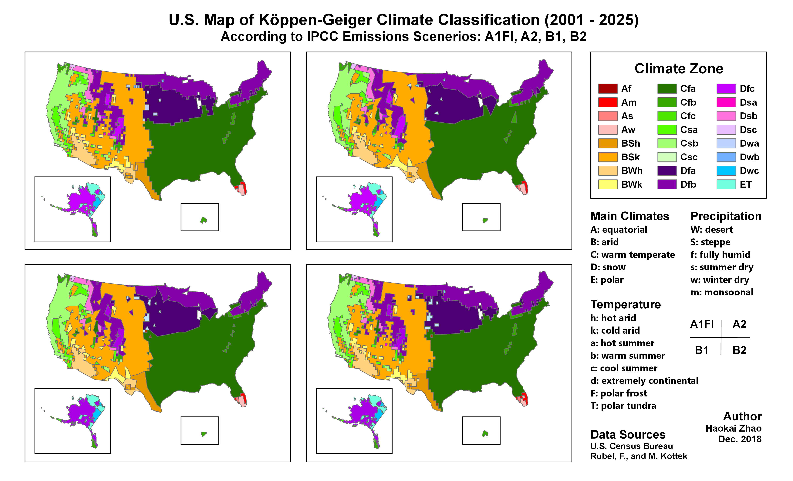

## General Scope

To analyze the **total emission quantities** and the **spatial distributions** of different greenhouse gases (GHGs) (e.g., carbon dioxide, methane, nitrous oxide) in the U.S. using **facility-level data**. 

## Dataset to investigate

#### [EPA Greenhouse Gas Reporting Program (GHGRP) Dataset](https://www.epa.gov/enviro/greenhouse-gas-customized-search)

## Analysis to Do

In the GHGRP dataset, the reported information includes the gas type and the location of the facilities. With other related data, we can calculate the total emissions of the specific GHGs. Also, we can investigate the spatial distribution (e.g., in different states, in different climate zones) of the emissions.

